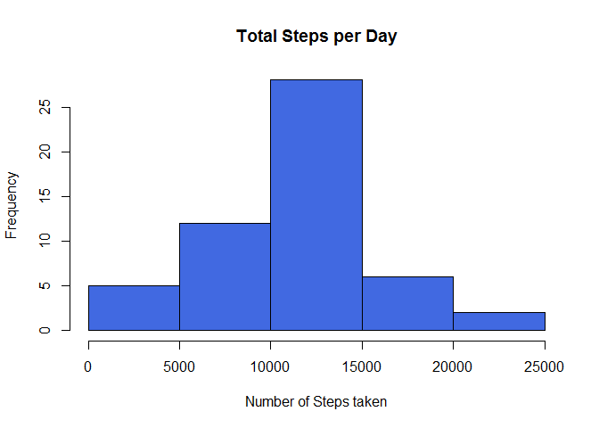
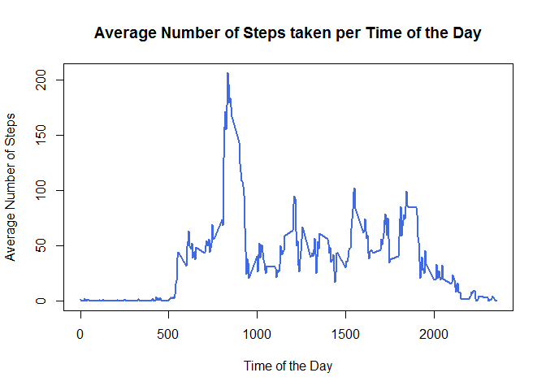
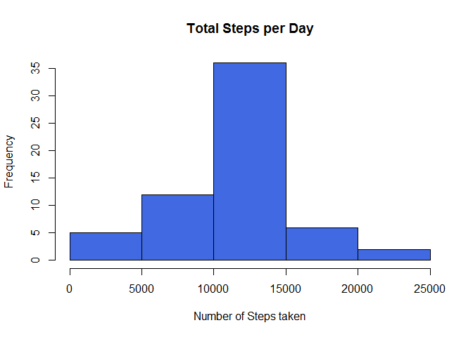

# Reproducible Research: Peer Assessment 1


## Loading and preprocessing the data

```r
if (!file.exists("activity.csv")) {
  download.file("https://d396qusza40orc.cloudfront.net/repdata%2Fdata%2Factivity.zip", "activity.zip")
  unzip("activity.zip")
}
act <- read.csv("activity.csv")
```


## What is mean total number of steps taken per day?


```r
library(plyr)
daily_totals <- aggregate(act$steps, list(act$date), sum)
names(daily_totals) <- c("Date","Steps")
daily_totals$Date <- as.Date(daily_totals$Date)
daily_totals$Steps <- as.numeric(daily_totals$Steps)
daily_total <- na.omit(daily_totals)
hist(daily_total$Steps, main = "Total Steps per Day", xlab = "Number of Steps taken", col = "royalblue")
```

<!-- -->

```r
stepmean <- round(mean(daily_total$Steps),4)
stepmedian <- round(median(daily_total$Steps),4)
stepmean_ch <- as.character(stepmean)
stepmedian_ch <- as.character(stepmedian)
```

The mean number of steps is 10766.1887, while the median is 10765.


## What is the average daily activity pattern?


```r
daily_int <- aggregate(act$steps, by = list(act$interval), FUN=mean, na.rm=TRUE)
names(daily_int) <- c("Interval", "Steps")
plot(x = daily_int$Interval, y = daily_int$Steps, type = "l", xlab = "Time of the Day", ylab = "Average Number of Steps", main = "Average Number of Steps taken per Time of the Day", pch = 1, lwd = 2, col = "royalblue")
```

<!-- -->

```r
daily_int_s <- daily_int[order(daily_int$Steps),]
Highest_no_steps <- tail(daily_int_s,1)[,1]
time <- substr(as.POSIXct(sprintf("%04.0f", Highest_no_steps), format='%H%M'), 12, 16)

if(time < "12:00") {
time <- paste(as.character(time), " ", "AM")
} else {time <- paste(as.character(time), " ", "PM")}
```

During the average day, the interval-number on which a person makes the highest number of steps is on 
835, which we commonly know as 08:35   AM.

## Imputing missing values


```r
Number_of_NA <- length(which(is.na(act)))

act2 <- act
act_rows <- which(is.na(act$steps))
act2$steps[act_rows] <- daily_int$Steps[match(act2$interval[act_rows], daily_int$Interval)]

daily_totals2 <- aggregate(act2$steps, list(act2$date), sum)
names(daily_totals2) <- c("Date","Steps")
daily_totals2$Date <- as.Date(daily_totals2$Date)
daily_totals2$Steps <- as.numeric(daily_totals2$Steps)
daily_total2 <- na.omit(daily_totals2)
hist(daily_total2$Steps, main = "Total Steps per Day", xlab = "Number of Steps taken", col = "royalblue")
```

<!-- -->

```r
stepmean2 <- round(mean(daily_total2$Steps),4)
stepmedian2 <- round(as.numeric(median(daily_total2$Steps)),4)
stepmean2_ch <- as.character(stepmean2)
stepmedian2_ch <- as.character(stepmedian2)
meandiff <- stepmean2 - stepmean
meandiff_ch <- as.character(meandiff)
mediandiff <- stepmedian2 -stepmedian
```
Within the dataset there are 2304 missing values.
I replaced these with the average for that particular interval within the whole dataset and put these in a new dataset called `act2`.
Within this new dataset, the mean of the total number of steps per day is 10766.1887 and median is 10766.1887.
Imputing missing data thus has the following effect:
The mean increased by 0, meaning that it's left unchanged. The reason behind this is that we simply added the exact averages of an existing dataset and then took the 'new' average, which is exactly the same.
Meanwhile, the median increased by 1.1887, because the median has 2304 more rows to take into account and we imputed exactly the mean values to the dataset. This results in the mean being equal to the median.

## Are there differences in activity patterns between weekdays and weekends?


```r
act2$dow <- weekdays(as.Date(act2$date))
act2$time_of_week <- as.factor(ifelse((act2$dow %in% c("zaterdag", "zondag")), (act2$time_of_week <- "weekend"), (act2$time_of_week <- "weekday")))

daily_int_weekday <- aggregate(act2$steps[act2$time_of_week=="weekday"], by = list(act2$interval[act2$time_of_week=="weekday"]), FUN=mean, na.rm=TRUE)

daily_int_weekend <- aggregate(act2$steps[act2$time_of_week=="weekend"], by = list(act2$interval[act2$time_of_week=="weekend"]), FUN=mean, na.rm=TRUE)
names(daily_int_weekday) <- c("Interval", "Steps_weekday")
names(daily_int_weekend) <- c("Interval", "Steps_weekday")
daily_int_total <- merge(daily_int_weekday,daily_int_weekend, by = "Interval")
names(daily_int_total) <- c("Interval","Steps_weekday", "Steps_weekend")

par(mfrow=c(2,1), mar = c(4,3.8,2.6,2.6)) # c(2.7,2.7,1.8,1.8))
plot(data = daily_int_total, Steps_weekend ~ Interval, col = "seagreen", ylab = "Steps", main = "Weekend", cex.main = 1, cex.lab = 0.85, lwd = 1, type = "l", ylim = range(Steps_weekend, Steps_weekday))
plot(data = daily_int_total, Steps_weekday ~ Interval, col = "royalblue", ylab = "Steps",main= "Weekday", cex.main = 1, cex.lab = 0.85, type = "l", ylim = range(Steps_weekend, Steps_weekday))
```

<!-- -->


